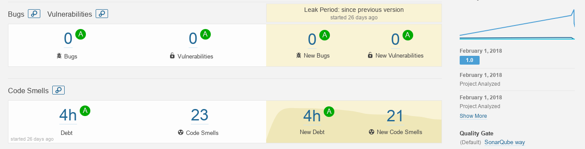

# Development

## Language and Tools

To develop a Web Application for the project we used **PHP 7.1** for the backend and **HTML5, CSS3, Javascript** for the frontend.

Together with PHP we used [Laravel](https://laravel.com/), a framework with ease of use, cleanliness and best practices in mind. Since it came with many out-of-the box features it allowed us to focus on the design and implementation of the core business logic of the project. We enriched Laravel with a few packages to again, improve the development experience, mainly [Carbon](carbon.nesbot.com/docs/) (for working with dates) and [Guzzle](docs.guzzlephp.org/en/stable/quickstart.html) for working with external HTTP APIs.

For the frontend since it was very time consuming writing the style from scratch we used [Bulma.io](https://bulma.io) a modern CSS framework that does provide already-made components for implementing web interfaces. We also used [jQuery](http://jquery.com/) for handling user interaction in Javascript and modern Web APIs for sending push notifications to users (namely the [Service Worker API](https://developer.mozilla.org/en-US/docs/Web/API/Service_Worker_API))

For handling the best compatibility across the development and the production environment we used [Docker](https://www.docker.com/what-docker), a container-based solution that allowed us to develop without worrying about having the same packages/operating systems. We used an existing Docker configuration, called [Laradock](http://laradock.io/)

We kept track of the development using [git](https://git-scm.com/) and hosted the project on [GitHub](https://github.com/) as a public repository since we decided that there was no point in hiding the code and it could be useful to others developing for the same problematic. Mostly the development took place on the `master` branch but sometiems we created feature branches when we were making braking changes and did not want to distrupt other developers. Examples of branches are the `push-notifications` branch and `improve-UI` branch.

We decided to keep track of the work to be done using a [Kanban board](https://leankit.com/learn/kanban/kanban-board/) 3-column approach, keeping track using the Projects feature of GitHub. You can [see the Kanban board here](https://github.com/PersonalizedTravelMonitor/Application/projects/1).

## Project structure

The project is organized as a [standard Laravel application](https://laravel.com/docs/5.5/structure), with a few custom packages and namespaces defined for our use case:

* `app/`, the code at the core of the project
	* `Console/`, custom [Laravel commands](https://laravel.com/docs/5.0/artisan) for the periodic background checks
	* `Exceptions/`, custom exceptions defined for the application
	* `ExternalAPIs/`, classes that interface with external services, such as Trenord, Trenitalia and ATM APIs
	* `Factories/`, factories to build complex objects
	* `Http/`
		* `Controllers/`, the MVC controllers
			* `Auth/`, special controllers to handle user authentication
		* `Middleware/`, [requests middlewares](https://laravel.com/docs/5.5/middleware) to handle connection to routes
	* `Models/`, the MVC models to handle all the objects relevant to our project
	* `Notifications/`, special objects to handle the notifications across the application and to the users
	* `Providers`, Laravel services that we did not use
	* `SearchInfoProviders`, classes that offer methods to implement search for all the various sources of informations
	* `TripPartManagers`, classes to handle the different kind of `TripPart`s and get updates on them
	* `Utils.php`, a few helper methods
* `config/`, project configuration files
* `database/`
	* `migrations/`, files describing how to [build the database schema](https://laravel.com/docs/5.5/migrations)
	* `seeds/`, [seeder classes](https://laravel.com/docs/5.5/seeding) to insert placeholder data into the Database after building it
* `public/`, for files to be served as-is by the Web Server
* `resources/`
	* `views/`, files needed by Laravel at run time to build and serve views to the user
* `routes/`, files defining routes (URLs) for the application
* `storage/`
	* `app/`, files that needs to be accessed by the application at runtime
* `.editorconfig`, [EditorConfig](http://editorconfig.org/) file for keeping the code style consistent across developers
* `composer.json`, file containing informations on all the external packages required by the application
* `readme.md`, developer documentation for the project
* `sonar-project.properties`, SonarQube configuration file

All the other files or directories are required by Laravel and were untouched.

## Patterns

Since, according to the requirement analysis, we had to develop a Web Application we decided to use an **MVC (Model View Controller)** approach for the main parts of our project. Some other parts, mainly the one that takes care of periodically checking if there are delays/events for the registered trip was developed similar to a **Broker/Worker** structure but it is a bit simpler, implemented, for example, without queues or complex services to hanle the tasks.

Since we developed the project using the PHP framework [Laravel](https://laravel.com/), it was quite straight forward to develop following the MVC pattern, since Models, Views and Controllers are at the base of the framework.

Another important pattern we applied for allowing a more agile workflow is the **Evolutionary Database Design**. It is well explained by Martin Fowler [in this webpage](https://martinfowler.com/articles/evodb.html). This pattern allows for faster prototyping and for keeping track of the DB Schema changes in the git repo.

In the design pattern compartment we used a few, mostly the one enforced by the framework by design and a few other because we felt it were necessary.

* **ORM Pattern**/**Active record**, this pattern is widely used in the project for accessing the database and for mapping the Models to the database. Provided by Laravel.
* **Builder Pattern**, used to create the queries to be executed by the ORM. Provided by Laravel.
* **Facade**, used for implementing the different data sources so that they expose a common interface. It was used together with the **Template Class** pattern.
* **Publish/Subscribe**, for handling notifications and application-wide communication.
* **Transform view**, for providing different representations of widely used objects, such as the various kinds of `Event`s.
* **Factory**, used for creating complex objects such as `Event`s and its specialized subobjects (`DelayEvent`, `GenericInformationEvent` and similar).

## Testing the project locally

In the [code repository](https://github.com/PersonalizedTravelMonitor/Application/blob/master/readme.md#development-setup) we included some instructions on how to build and test the software locally. There are a few requirements: [Docker](https://docker.com), [Docker Compose](https://docs.docker.com/compose/), [git](https://git-scm.com/).

Since it is a pretty long process to build it locally (there are a few steps to follow and it can take some times to download all the packages and docker images) we decided to [deploy the project here](travelmonitor.duckdns.org) for you to try out. We also created a demo account (`demo@demo.com` with password `password`) which has admin permissions and a few trips already planned.

**Warning:** To also deploy a fully working version of the project (not only building and starting but also allowing the user to login via Social Networks, search and follow trips) you need a few values to insert into the `.env` files, API keys and other *secrets* that we can't ([and should not](https://softwareengineering.stackexchange.com/questions/205606/strategy-for-keeping-secret-info-such-as-api-keys-out-of-source-control)) share on a version controlled public repository. If you want these values please get in touch with the group supervisor ([s.vitali@campus.unimib.it](mailto:s.vitali@campus.unimib.it))

## SonarQube Integration

To keep track of code quality we used [SonarQube](https://www.sonarqube.org/) together with [SonarQube Scanner](https://docs.sonarqube.org/display/SCAN/Analyzing+with+SonarQube+Scanner). This proven quite a useful tools, since it allowed us to keep track of the code as it grew and improve it as necessary. We aimed (and got) 0 bugs and `A` level for code smells; there are still some code smells left in the code (about 20, *all* about string literals not being represented as constants) especially related to a particular class: `App\ExternalAPIs\TrenordSearchResultsCleaner`. It is possible to fix them just to please SonarQube, but it would be *wrong* since that class is responsible for walking through an object with many different fields and removing the unnecessary ones: having constants insteaad of strings would not remove the complexity of the code. The same goes for the same kind of code smells in the other classes.

To make SonarQube work with the project we had to create a `sonar-project.properties` file that specifies in which directories SonarQube had to look for code. After starting SonarQube and running `sonar-scanner` inside the project folder the code gets analized and the results are served in the Web Inteface of SonarQube.

